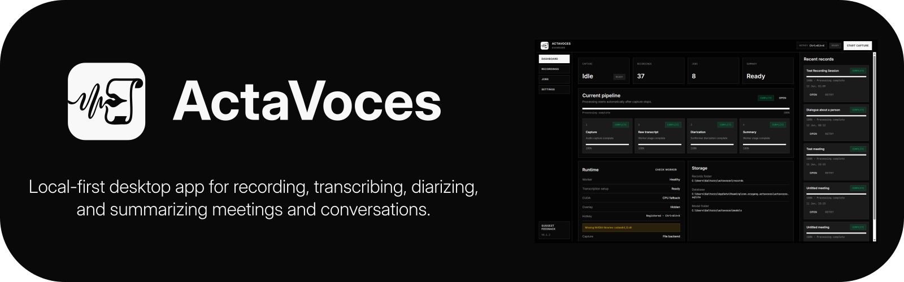

# ActaVoces

<p align="center">
  
</p>

<p align="center">
  <a href="https://github.com/EzyGang/actavoces/actions/workflows/ci.yml">
    
  </a>
  
  
</p>

---

**ActaVoces** is a local-first desktop meeting recorder for people who want their recordings, transcripts, speaker labels, and notes saved as normal files they can inspect and keep.

It records microphone and system audio, transcribes locally, adds optional speaker labels, and writes Markdown plus JSON artifacts beside each recording.

> [!WARNING]
> ActaVoces is usable and is being used, but it is still open-source pre-1.0 software without comprehensive multi-platform QA. It has seen ongoing Windows use, lighter macOS use, and Linux currently lacks active QA.

**Pronunciation:** `AHK-tah VOH-kays`  
**Name:** `acta` means records or proceedings, and `voces` means voices.

---

## Table of Contents

- [Why ActaVoces?](#why-actavoces)
- [Download](#download)
- [First Run](#first-run)
- [What You Get](#what-you-get)
- [Privacy and Remote Features](#privacy-and-remote-features)
- [Backends](#backends)
- [Platform Support](#platform-support)
- [Development](#development)
- [Architecture](#architecture)
- [Releases](#releases)
- [Contributing](#contributing)
- [License](#license)

---

## Why ActaVoces?

**🗂️ Your meeting archive stays yours**  
Recordings are stored under your configured records folder. The files are readable outside the app, easy to back up, and not locked inside a hosted workspace.

**🎙️ Local transcription by default**  
Transcription runs through the bundled Python worker with `faster-whisper`. You choose and install the supported model from the app.

**📁 Useful files, not mystery blobs**  
Each recording becomes a folder with WAV audio, Markdown transcripts, JSON segment data, speaker-label data, metadata, and a job log.

**🗣️ Speaker labels when you need them**  
Use the default local Sortformer backend, a one-speaker mode, or the optional `pyannote.audio` backend if you want that workflow.

**🔁 Recovery is part of the app**  
SQLite tracks recordings, settings, artifacts, models, and pipeline jobs. Failed or setup-blocked stages can be retried from the desktop UI.

| Feature | What it helps with |
| --- | --- |
| Recording archive | Keep stable, inspectable meeting folders on disk |
| Desktop capture | Record microphone and available system audio |
| Local transcription | Generate transcripts without a required hosted service |
| Speaker labels | Split transcript text by detected speaker turns |
| Speaker editing | Rename speakers and regenerate diarized transcripts |
| Optional summaries | Use an OpenAI-compatible provider only when enabled |
| Pipeline recovery | Retry failed stages from the app |

---

## Download

Published builds are available from the [GitHub Releases page](https://github.com/EzyGang/actavoces/releases).

| Platform | Downloads |
| --- | --- |
| Windows x64 | [Setup EXE](https://github.com/EzyGang/actavoces/releases/latest/download/ActaVoces-windows-x64-setup.exe) / [MSI](https://github.com/EzyGang/actavoces/releases/latest/download/ActaVoces-windows-x64.msi) |
| macOS Apple Silicon | [DMG](https://github.com/EzyGang/actavoces/releases/latest/download/ActaVoces-macos-aarch64.dmg) |
| macOS Intel | [DMG](https://github.com/EzyGang/actavoces/releases/latest/download/ActaVoces-macos-x64.dmg) |
| Linux x64 | [AppImage](https://github.com/EzyGang/actavoces/releases/latest/download/ActaVoces-linux-x64.AppImage) / [DEB](https://github.com/EzyGang/actavoces/releases/latest/download/ActaVoces-linux-x64.deb) / [RPM](https://github.com/EzyGang/actavoces/releases/latest/download/ActaVoces-linux-x64.rpm) |

If there is no build for your platform yet, use the [development setup](#development) below to run from source.

> [!NOTE]
> Builds are not code-signed yet. Code signing is expensive for a simple open-source app. macOS builds may later move through App Store distribution and signing, Linux packaging can improve over time, and Windows builds will likely remain unsigned for a while. Operating systems may warn that the app is from an unknown publisher.

---

## First Run

1. Open ActaVoces.
2. Keep network access available during setup.
3. Wait while ActaVoces prepares the local worker runtime and default settings.
4. Let the app download and install the default transcription model automatically.
5. Allow the OS microphone and audio-capture permissions when prompted.
6. Start a recording from the app, tray, global hotkey, or floating overlay.

Initial setup requires network access for model downloads. After the local transcription model and local speaker-label backend are prepared, normal recording and local processing can run without network access. Summary generation is disabled unless you configure a provider.

Users are responsible for consent and recording-law compliance in their jurisdiction.

---

## What You Get

Each recording gets a folder under the configured records directory:

```text
~/actavoces/records/YYYY-MM-DD-HHMM-title/
```

Human-readable files live at the recording folder root:

```text
raw-transcript.md
diarized-transcript.md
```

Machine-readable artifacts and audio files live under `meta/`:

```text
meta/
  recording.wav
  microphone.wav
  raw-segments.json
  raw-words.json
  diarization.json
  summary.md
  metadata.json
  job-log.jsonl
```

The raw transcript can appear before speaker labels and summaries finish. Later stages update their own files instead of rewriting one combined note.

---

## Privacy and Remote Features

ActaVoces keeps recording and primary processing local by default.

| Stage | Implementation | Local by default? |
| --- | --- | --- |
| Capture | Rust + `cpal` | Yes |
| Transcription | Python worker + `faster-whisper` | Yes |
| Speaker labels | Rust Sortformer/ONNX or Python `pyannote.audio` | Yes for Sortformer |
| Summary | OpenAI-compatible provider | Disabled by default; depends on provider settings |
| Storage | SQLite + files on disk | Yes |

Remote or networked behavior is explicit:

- Model downloads need network access.
- Optional `pyannote.audio` setup needs Hugging Face access and accepted model terms.
- Optional summaries call the provider you configure. They can stay local with a local OpenAI-compatible endpoint such as Ollama, or use any other OpenAI-compatible API if you choose one.
- Summary generation can remain disabled without blocking recording, transcription, or speaker labels.

---

## Backends

### Transcription

ActaVoces uses `faster-whisper` through the Python worker. The app exposes model inventory and installation controls for:

- `small`
- `medium`
- `large-v3`
- `distil-large-v3`

Compute mode can be automatic, CPU, CUDA, or Metal. CUDA mode requires the NVIDIA runtime libraries shown in Settings.

### Speaker Labels

ActaVoces currently supports two speaker-label backends:

- **Sortformer:** the default local backend. It uses a bundled Rust path with ONNX Runtime and downloads the Sortformer ONNX model on first use. It does not require a Hugging Face token.
- **pyannote:** optional Python-worker backend using `pyannote.audio` and `pyannote/speaker-diarization-community-1`. It requires accepted Hugging Face model terms, a Hugging Face token, and FFmpeg.

pyannoteAI cloud API support is not implemented.

### Summaries

Summaries are disabled by default. When enabled, they use an OpenAI-compatible provider through `pydantic-ai`. You can point the base URL at a local provider such as Ollama, or at a remote provider if that is what you want.

You can configure:

- Base URL
- Model
- API key
- Summary prompt

---

## Platform Support

ActaVoces is a desktop app built with Tauri v2.

| Platform | Status | Notes |
| --- | --- | --- |
| Windows | Build target | CI and release workflow build Windows x64. |
| macOS | Build target | CI plus Apple Silicon and Intel release builds. |
| Linux | Build target | CI and release workflow build Linux x64. System audio requires a PipeWire/PulseAudio monitor or loopback input device. |

---

## Development

### Prerequisites

- Node.js 22 with `pnpm`
- Rust stable with Cargo
- Tauri v2 system dependencies for your OS
- Python 3.14
- `uv`
- OS microphone and audio-capture permissions

### Setup

Install dependencies:

```bash
pnpm install
pnpm sync:py
```

Run the desktop app:

```bash
pnpm tauri dev
```

Run only the Vite renderer:

```bash
pnpm dev
```

The renderer dev server uses port `1420`.

### Common Commands

```bash
pnpm dev          # Vite renderer dev server
pnpm tauri dev    # Tauri desktop app
pnpm validate     # Biome + TypeScript checks
pnpm lint:ts      # Biome + TypeScript
pnpm lint:rust    # cargo fmt, clippy, and cargo check
pnpm lint:py      # Ruff and basedpyright
pnpm lint:all     # TypeScript, Rust, and Python lint/type checks
pnpm test         # Vitest
pnpm test:rust    # Rust tests
pnpm test:py      # Python worker tests
pnpm test:all     # Frontend, Rust, and Python tests
pnpm build:web    # Vite production build
pnpm build:landing # Static landing page build -> dist-landing/
pnpm build        # Tauri production build
```

Worker commands run from `worker/`:

```bash
uv run task ruff-lint
uv run task pyright-lint
uv run task tests
```

Formatting commands:

```bash
pnpm format       # Format TypeScript
pnpm format:rust  # Format Rust and apply safe clippy fixes
pnpm format:py    # Format Python worker
pnpm format:all   # Format all code
```

---

## Architecture

```text
src/                 Preact renderer
src-tauri/           Tauri shell, Rust commands, capture, storage, updater
worker/              Python worker for transcription, pyannote, and summaries
public/              Static renderer assets
```

Main stack:

- **Frontend:** Preact 10, TypeScript, `@preact/signals`, Tailwind CSS v4, Base UI
- **Desktop backend:** Tauri v2, Rust, SQLite through `rusqlite`, native capture through `cpal`
- **Speaker labels:** Rust Sortformer/ONNX path plus optional Python `pyannote.audio`
- **Worker:** Python 3.14, `uv`, Pydantic, `faster-whisper`, `pydantic-ai`

The Rust app owns windows, tray behavior, hotkeys, capture, filesystem paths, SQLite state, updater integration, and worker orchestration. The Python worker owns ML-heavy transcription, optional pyannote diarization, and summary calls.

### Frontend Shape

The renderer is organized by feature under `src/components/`. Feature code follows a hook/view/container split:

- Hooks own state, effects, services, and callback binding.
- Views are presentational JSX and styling.
- Containers connect hook output to views.

Shared renderer state lives in signal stores under `src/stores/`. Tauri calls are wrapped in service modules under `src/services/`.

### Desktop Shape

Rust command handlers live under `src-tauri/src/app/commands/`. Non-command logic is kept in domain folders:

- `capture/`: native audio device discovery, capture, WAV writing, and mixing
- `storage/`: SQLite repository, settings, recordings, artifacts, and jobs
- `worker/`: Python worker bootstrap and JSONL command execution
- `diarization/`: Sortformer setup and local diarization output
- `artifacts/`: recording folder paths and generated file paths

SQLite setup is additive and defensive. Generated artifact paths should be treated as part of the user-facing contract.

### Worker Shape

The worker receives newline-delimited JSON commands from the Rust app and emits JSON events. It owns:

- `faster-whisper` transcription
- model status and model installation checks
- optional `pyannote.audio` diarization
- OpenAI-compatible summary generation

Worker code lives under `worker/app/`; worker tests live under `worker/tests/`.

---

## Releases

Releases are created with the GitHub Actions release workflow.

- Manual dispatch publishes either a full release or alpha release.
- The root `package.json` version is the release source of truth.
- Build artifacts are uploaded to GitHub Releases.
- Tauri updater metadata is generated as part of the release.

---

## Contributing

Contributions are welcome. Keep changes focused, tested where practical, and aligned with the local-first file archive model.

### Good First Contributions

Good places to start:

- Documentation fixes
- Platform setup notes
- Focused UI polish
- Worker error-message improvements
- Tests for existing behavior

### Before Larger Changes

Before starting a larger change, open an issue or draft pull request that explains:

- **Problem:** what user pain or project risk the change addresses
- **Approach:** how the change fits the current architecture
- **Tradeoffs:** any dependency, runtime cost, model behavior, storage change, or compatibility risk
- **Validation:** how the change will be tested

This matters most for capture behavior, artifact formats, database schema, pipeline job semantics, worker setup, release packaging, and any networked provider behavior.

### Pull Request Checklist

Before opening a pull request, run the checks that match your changes:

```bash
pnpm validate
pnpm test
pnpm lint:rust
pnpm test:rust
pnpm lint:py
pnpm test:py
```

Use narrower checks while iterating and broader checks before review:

```bash
pnpm lint:ts
pnpm test
pnpm lint:rust
pnpm test:rust
pnpm lint:py
pnpm test:py
```

### Engineering Guidelines

- Keep pull requests small.
- Preserve artifact compatibility. Do not rename, move, or change generated files without a migration path and README update.
- Keep remote processing explicit in Settings and user-facing text.
- Do not log secrets, transcript content, provider API keys, or Hugging Face tokens.
- Keep frontend work aligned with the hook/view/container pattern.
- Keep Rust command handlers thin and put domain behavior in the owning module.
- Keep Python imports rooted at `app.` and keep worker commands typed.
- Add tests for behavior changes where practical.
- Document tested operating systems for capture, hotkey, overlay, autostart, and updater changes.
- Treat SQLite migrations as additive by default. Do not drop user data without explicit approval and a migration plan.
- Keep generated artifacts useful outside the app. Markdown should be readable; JSON should stay machine-friendly.

---

## License

ActaVoces is licensed under `AGPL-3.0-or-later`. See [LICENSE](LICENSE).
